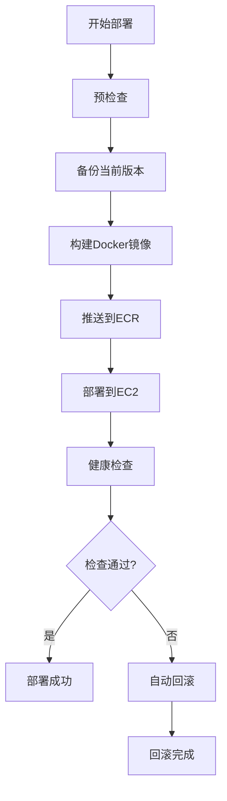

# 🚀 前端部署指南

## 📋 概述

本指南提供了两种前端部署方式：
1. **快速部署**：直接上传源码到服务器构建（适合开发测试）
2. **生产部署**：Docker镜像方式（推荐用于生产环境）

## 🎯 方式一：快速部署（当前进行中）

### 步骤：
1. ✅ 上传前端源码到服务器（进行中）
2. 🔄 在服务器上构建Angular应用
3. 🔄 配置Nginx代理
4. 🔄 启动前端服务

### 完成上传后执行：
```bash
# SSH到服务器
ssh -i fuser23-airline-order-keypair.pem ec2-user@18.116.240.81

# 进入前端目录
cd /opt/airline-order/frontend

# 安装依赖
npm install

# 构建生产版本
npm run build

# 配置Nginx并启动
```

## 🏭 方式二：生产Docker部署（推荐）

### 文件结构：
```
airline-order-course/
├── frontend.Dockerfile              # 前端Docker构建文件
├── docker-compose.production.yml    # 生产环境编排
├── safe-frontend-deploy.sh          # 安全部署脚本
└── FRONTEND_DEPLOYMENT_GUIDE.md     # 本指南
```

### 🔧 核心文件说明

#### 1. frontend.Dockerfile
- **多阶段构建**：先用Node.js构建，再用Nginx服务
- **优化镜像大小**：最终镜像只包含构建产物和Nginx
- **生产就绪**：包含所有必要的配置

#### 2. safe-frontend-deploy.sh
- **安全部署**：包含回滚机制
- **健康检查**：自动验证部署是否成功
- **备份管理**：自动备份和清理旧版本
- **错误处理**：部署失败自动回滚

#### 3. docker-compose.production.yml
- **完整栈部署**：MySQL + 后端 + 前端
- **网络隔离**：使用Docker网络
- **持久化存储**：数据库数据持久化

### 🚀 执行生产部署

```bash
# 1. 确保在项目根目录
cd airline-order-course

# 2. 执行安全部署脚本
./safe-frontend-deploy.sh

# 3. 如果需要回滚
./safe-frontend-deploy.sh --rollback
```

### 📊 部署流程



## 🔍 部署后验证

### 访问地址：
- **前端应用**: http://18.116.240.81
- **后端API**: http://18.116.240.81:8080/api/flights
- **API文档**: http://18.116.240.81:8080/swagger-ui/index.html

### 验证步骤：
1. **前端加载**：访问主页，检查页面是否正常加载
2. **API连接**：测试登录功能，验证前后端通信
3. **功能测试**：测试主要业务功能

## 🛠️ 故障排除

### 常见问题：

#### 1. 构建失败
```bash
# 检查Node.js版本
node --version  # 应该是 18.x

# 检查依赖
npm install --verbose
```

#### 2. 容器启动失败
```bash
# 查看容器日志
docker logs airline-frontend

# 检查容器状态
docker ps -a | grep airline-frontend
```

#### 3. 网络连接问题
```bash
# 检查网络
docker network ls
docker network inspect airline-network

# 测试后端连接
curl http://18.116.240.81:8080/api/flights
```

#### 4. 权限问题
```bash
# 检查文件权限
ls -la /opt/airline-order/

# 修复权限
sudo chown -R ec2-user:ec2-user /opt/airline-order/
```

## 🔄 CI/CD 集成

### GitHub Actions 工作流：

```yaml
name: 前端部署

on:
  push:
    branches: [ main ]
    paths: [ 'frontend/**' ]

jobs:
  deploy-frontend:
    runs-on: ubuntu-latest
    steps:
    - uses: actions/checkout@v3
    
    - name: 配置AWS凭证
      uses: aws-actions/configure-aws-credentials@v2
      with:
        aws-access-key-id: ${{ secrets.AWS_ACCESS_KEY_ID }}
        aws-secret-access-key: ${{ secrets.AWS_SECRET_ACCESS_KEY }}
        aws-region: us-east-2
    
    - name: 执行安全部署
      run: ./safe-frontend-deploy.sh
```

## 📈 性能优化

### 1. 构建优化
- **代码分割**：使用Angular的懒加载
- **资源压缩**：启用gzip压缩
- **缓存策略**：配置适当的缓存头

### 2. 运行时优化
- **CDN集成**：使用CloudFront加速
- **负载均衡**：多实例部署
- **监控告警**：集成CloudWatch

## 🔐 安全配置

### 1. 网络安全
- **HTTPS配置**：使用SSL证书
- **CORS设置**：限制跨域访问
- **安全头**：配置安全响应头

### 2. 容器安全
- **最小权限**：使用非root用户
- **镜像扫描**：定期扫描安全漏洞
- **秘钥管理**：使用AWS Secrets Manager

## 📞 支持

如果遇到问题：
1. 查看部署日志
2. 检查健康检查状态
3. 使用回滚功能恢复服务
4. 联系技术支持

---

**注意**：生产环境建议使用Docker镜像方式部署，确保环境一致性和可维护性。
